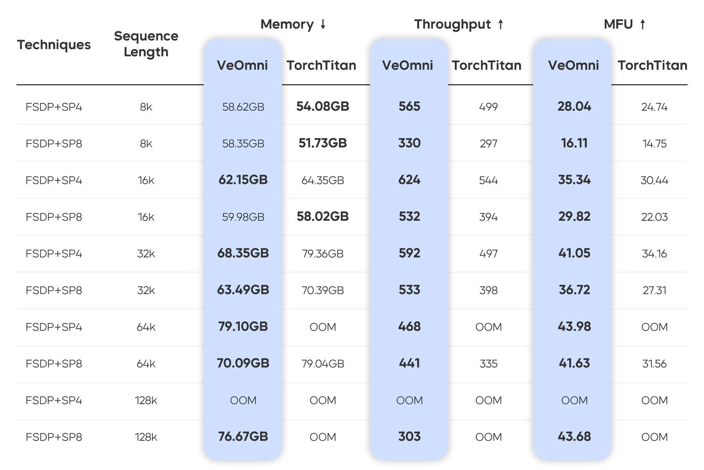

<div align="center">


<div align="center">
    VeOmni: Scaling Any Modality Model Training with Model-Centric Distributed Recipe Zoo
    <br>
    <br>
</div>

[](https://github.com/ByteDance-Seed/VeOmni/stargazers)
[](https://arxiv.org/abs/2508.02317)
[](https://veomni.readthedocs.io/en/latest/)
[](https://raw.githubusercontent.com/ByteDance-Seed/VeOmni/refs/heads/main/docs/assets/wechat.png)

</div>

## 🍪 Overview
VeOmni is a versatile framework for both single- and multi-modal pre-training and post-training. It empowers users to seamlessly scale models of any modality across various accelerators, offering both flexibility and user-friendliness.

Our guiding principles when building VeOmni are:
- **Flexibility and Modularity**: VeOmni is built with a modular design, allowing users to decouple most components and replace them with their own implementations as needed.
- **Trainer-free**: VeOmni avoids rigid, structured trainer classes (e.g., [PyTorch-Lightning](https://github.com/Lightning-AI/pytorch-lightning) or [HuggingFace](https://huggingface.co/docs/transformers/v4.50.0/en/main_classes/trainer#transformers.Trainer) Trainer). Instead, VeOmni keeps training scripts linear, exposing the entire training logic to users for maximum transparency and control.

- **Omni model native**: VeOmni enables users to effortlessly scale any omni-model across devices and accelerators.
- **Torch native**: VeOmni is designed to leverage PyTorch’s native functions to the fullest extent, ensuring maximum compatibility and performance.

<div align="center">

</div>

## 🔥 Latest News
- [2025/11] Our Paper [OmniScale: Scaling Any Modality Model Training with Model-Centric Distributed Recipe Zoo](https://arxiv.org/abs/2508.02317) was accepted by AAAI 2026
- [2025/09] We release first offical release [v0.1.0](https://github.com/ByteDance-Seed/VeOmni/pull/75) of VeOmni.
- [2025/08] We release [VeOmni Tech report](https://arxiv.org/abs/2508.02317) and open the [WeChat group](./docs/assets/wechat.png). Feel free to join us!
- [2025/04] We release VeOmni!


## 📚 Key Features
- **FSDP**, **FSDP2** backend for training.
- **Sequence Parallelism** with [Deepspeed Ulysess](https://arxiv.org/abs/2309.14509), support with non-async and async mode.
- **Experts Parallelism** support large MOE model training, like [Qwen3-Moe](https://veomni.readthedocs.io/en/latest/key_features/ep_fsdp2.html).
- Efficient **GroupGemm** kernel for Moe model, [Liger-Kernel](https://github.com/linkedin/Liger-Kernel).
- Compatible with HuggingFace Transformers models. [Qwen3](https://veomni.readthedocs.io/en/latest/examples/qwen3.html), [Qwen3-VL](https://veomni.readthedocs.io/en/latest/examples/qwen3_vl.html), Qwen3-Moe, etc
- Dynamic batching strategy, Omnidata processing
- [**Torch Distributed Checkpoint**](https://docs.pytorch.org/docs/stable/distributed.checkpoint.html) for checkpoint.
- Support for both Nvidia-GPU and Ascend-NPU training.
- Experiment tracking with wandb

## 📝 Upcoming Features and Changes

- VeOmni v0.2 Roadmap https://github.com/ByteDance-Seed/VeOmni/issues/268, https://github.com/ByteDance-Seed/VeOmni/issues/271
- Vit balance tool https://github.com/ByteDance-Seed/VeOmni/issues/280
- Validation dataset during training https://github.com/ByteDance-Seed/VeOmni/issues/247
- RL post training for omni-modality models with VeRL https://github.com/ByteDance-Seed/VeOmni/issues/262


## 🚀 Getting Started

<a href="https://veomni.readthedocs.io/en/latest/index.html"><b>Documentation</b></a>

### Quick Start
  - [Installation](https://veomni.readthedocs.io/en/latest/get_started/installation/install.html)
  - [Quick Start with Qwen3](https://veomni.readthedocs.io/en/latest/examples/qwen3.html)


## ✏️ Supported Models

| Model                                                    | Model size                    | Example config File                                                   |
| -------------------------------------------------------- | ----------------------------- | ----------------------------------------------------------------------|
| [DeepSeek 2.5/3/R1](https://huggingface.co/deepseek-ai)  | 236B/671B                     | [deepseek.yaml](configs/pretrain/deepseek.yaml)                       |
| [Llama 3-3.3](https://huggingface.co/meta-llama)         | 1B/3B/8B/70B                  | [llama3.yaml](configs/pretrain/llama3.yaml)                           |
| [Qwen 2-3](https://huggingface.co/Qwen)                  | 0.5B/1.5B/3B/7B/14B/32B/72B/  | [qwen2_5.yaml](configs/pretrain/qwen2_5.yaml)                         |
| [Qwen2-3 VL/QVQ](https://huggingface.co/Qwen)            | 2B/3B/7B/32B/72B              | [qwen3_vl_dense.yaml](configs/multimodal/qwen3_vl/qwen3_vl_dense.yaml)|
| [Qwen3-VL MoE](https://huggingface.co/Qwen)              | 30BA3B/235BA22B               | [qwen3_vl_moe.yaml](configs/multimodal/qwen3_vl/qwen3_vl_moe.yaml)    |
| [Qwen3-MoE](https://huggingface.co/Qwen)                 | 30BA3B/235BA22B               | [qwen3-moe.yaml](configs/pretrain/qwen3-moe.yaml)                     |
| [Wan](https://huggingface.co/Wan-AI)                     | Wan2.1-I2V-14B-480P           | [wan_sft.yaml](configs/dit/wan_sft.yaml)                              |
| Omni Model                                               | Any Modality Training         | [seed_omni.yaml](configs/multimodal/omni/seed_omni.yaml)              |

Support new models to VeOmni see [Support New Models](https://veomni.readthedocs.io/en/latest/usage/support_new_models.html)

## ⛰️ Performance

<div align="left">

</div>

For more details, please refer to our [paper](https://arxiv.org/abs/2508.02317).

## 💡 Awesome work using VeOmni
- [dFactory: Easy and Efficient dLLM Fine-Tuning](https://github.com/inclusionAI/dFactory)
- [LMMs-Engine](https://github.com/EvolvingLMMs-Lab/lmms-engine)
- [UI-TARS: Pioneering Automated GUI Interaction with Native Agents](https://github.com/bytedance/UI-TARS)
- [OpenHA: A Series of Open-Source Hierarchical
Agentic Models in Minecraft](https://arxiv.org/pdf/2509.13347)
- [UI-TARS-2 Technical Report: Advancing GUI Agent with Multi-Turn Reinforcement Learning](https://arxiv.org/abs/2509.02544)
- [Open-dLLM: Open Diffusion Large Language Models](https://github.com/pengzhangzhi/Open-dLLM)

## 🎨 Contributing

Contributions from the community are welcome! Please check out [CONTRIBUTING.md](CONTRIBUTING.md) our project roadmap(To be updated),


## 📝 Citation and Acknowledgement

If you find VeOmni useful for your research and applications, feel free to give us a star ⭐ or cite us using:

```bibtex
@article{ma2025veomni,
  title={VeOmni: Scaling Any Modality Model Training with Model-Centric Distributed Recipe Zoo},
  author={Ma, Qianli and Zheng, Yaowei and Shi, Zhelun and Zhao, Zhongkai and Jia, Bin and Huang, Ziyue and Lin, Zhiqi and Li, Youjie and Yang, Jiacheng and Peng, Yanghua and others},
  journal={arXiv preprint arXiv:2508.02317},
  year={2025}
}
```

Thanks to the following projects for their excellent work:

- [ByteCheckpoint](https://arxiv.org/abs/2407.20143)
- [veScale](https://github.com/volcengine/veScale)
- [Liger-Kernel](https://github.com/linkedin/Liger-Kernel)
- [LLaMA-Factory](https://github.com/hiyouga/LLaMA-Factory)
- [torchtitan](https://github.com/pytorch/torchtitan/)
- [torchtune](https://github.com/pytorch/torchtune)

## Star History

[](https://www.star-history.com/#ByteDance-Seed/VeOmni&type=date&legend=top-left)


## 🌱 About [ByteDance Seed Team](https://team.doubao.com/)

<div align="center">

</div>

Founded in 2023, ByteDance Seed Team is dedicated to crafting the industry's most advanced AI foundation models. The team aspires to become a world-class research team and make significant contributions to the advancement of science and society. You can get to know Bytedance Seed better through the following channels👇
<div>
  <a href="https://team.doubao.com/">
    </a>
  <a href="https://github.com/user-attachments/assets/469535a8-42f2-4797-acdf-4f7a1d4a0c3e">
    </a>
 <a href="https://www.xiaohongshu.com/user/profile/668e7e15000000000303157d?xsec_token=ABl2-aqekpytY6A8TuxjrwnZskU-6BsMRE_ufQQaSAvjc%3D&xsec_source=pc_search">
    </a>
  <a href="https://www.zhihu.com/org/dou-bao-da-mo-xing-tuan-dui/">
    </a>

</div>
