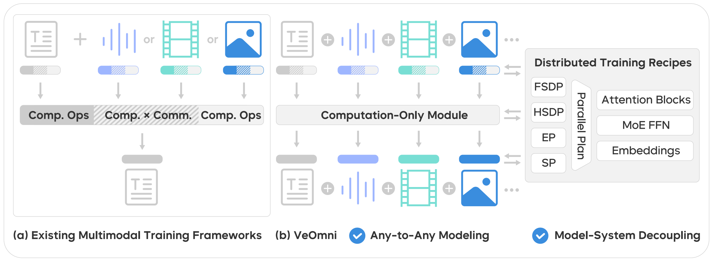

Welcome to VeOmni
=========================

.. image:: ./assets/logo.png
   :width: 50%
   :align: center

VeOmni: Scaling Any Modality Model Training with Model-Centric Distributed Recipe Zoo
=================================================================================================

.. raw:: html

   

     
     
     
     
      
     
     
   

Overview
--------

VeOmni is a versatile framework for both single- and multi-modal pre-training and post-training. It empowers users to seamlessly scale models of any modality across various accelerators, offering both flexibility and user-friendliness.

Our guiding principles when building VeOmni are:

- **Flexibility and Modularity**: VeOmni is built with a modular design, allowing users to decouple most components and replace them with their own implementations as needed.
- **Trainer-free**: VeOmni avoids rigid, structured trainer classes (e.g., `PyTorch-Lightning <https://github.com/Lightning-AI/pytorch-lightning>`_ or `HuggingFace <https://huggingface.co/docs/transformers/v4.50.0/en/main_classes/trainer#transformers.Trainer>`_ Trainer). Instead, VeOmni keeps training scripts linear, exposing the entire training logic to users for maximum transparency and control.
- **Omni model native**: VeOmni enables users to effortlessly scale any omni-model across devices and accelerators.
- **Torch native**: VeOmni is designed to leverage PyTorch's native functions to the fullest extent, ensuring maximum compatibility and performance.

----------------------------------------------------------

.. _Contents:

.. toctree::
   :maxdepth: 1
   :caption: Get Started

   get_started/installation/install.md
   get_started/quick_start/quick_start_qwen3.md

.. toctree::
   :maxdepth: 1
   :caption: Usage

   usage/basic_modules.md
   usage/arguments.md
   usage/support_new_models.md

.. toctree::
   :maxdepth: 1
   :caption: Examples

   examples/qwen2vl
   examples/qwen3_moe.md
   examples/qwen3_vl.md

.. toctree::
   :maxdepth: 1
   :caption: Key Features

   key_features/ep_fsdp2.md
   key_features/ulysses.md
   key_features/preprocessor_registry.md

---------------------------------------

📝 Citation
--------------------

If you find VeOmni useful for your research and applications, feel free to give us a star ⭐ or cite us using:

.. code-block:: bibtex

   @article{ma2025veomni,
     title={VeOmni: Scaling Any Modality Model Training with Model-Centric Distributed Recipe Zoo},
     author={Ma, Qianli and Zheng, Yaowei and Shi, Zhelun and Zhao, Zhongkai and Jia, Bin and Huang, Ziyue and Lin, Zhiqi and Li, Youjie and Yang, Jiacheng and Peng, Yanghua and others},
     journal={arXiv preprint arXiv:2508.02317},
     year={2025}
   }

🌱 About `ByteDance Seed Team <https://team.doubao.com/>`_
------------------------------------------------------------------------

.. image:: https://github.com/user-attachments/assets/c42e675e-497c-4508-8bb9-093ad4d1f216
   :alt: seed logo

Founded in 2023, ByteDance Seed Team is dedicated to crafting the industry's most advanced AI foundation models. The team aspires to become a world-class research team and make significant contributions to the advancement of science and society.

You can get to know us better through the following channels👇

.. raw:: html

   

      
     
     
    
     
   

