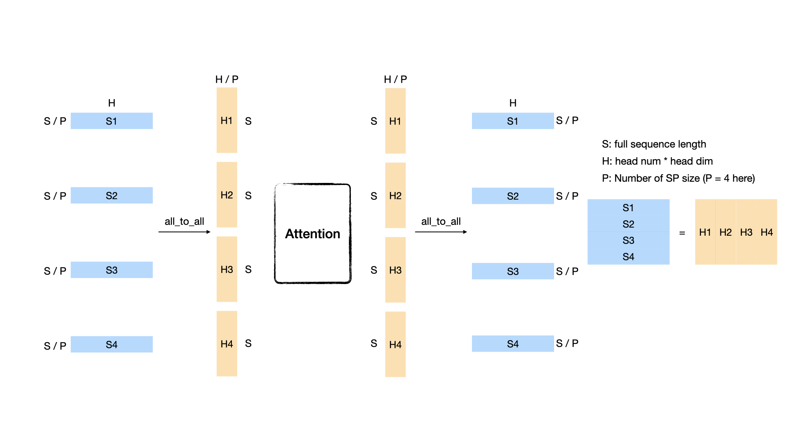
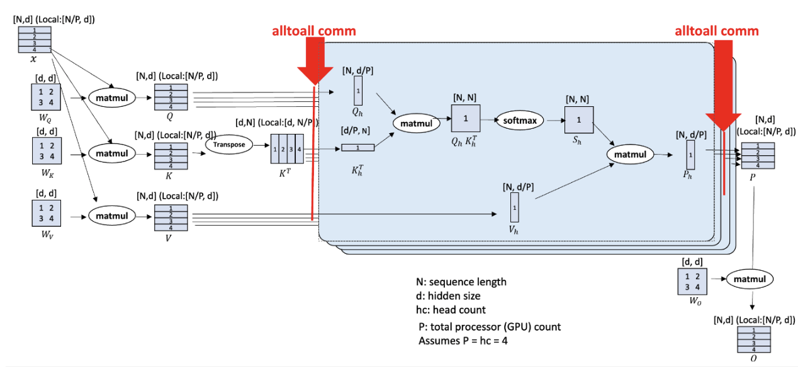
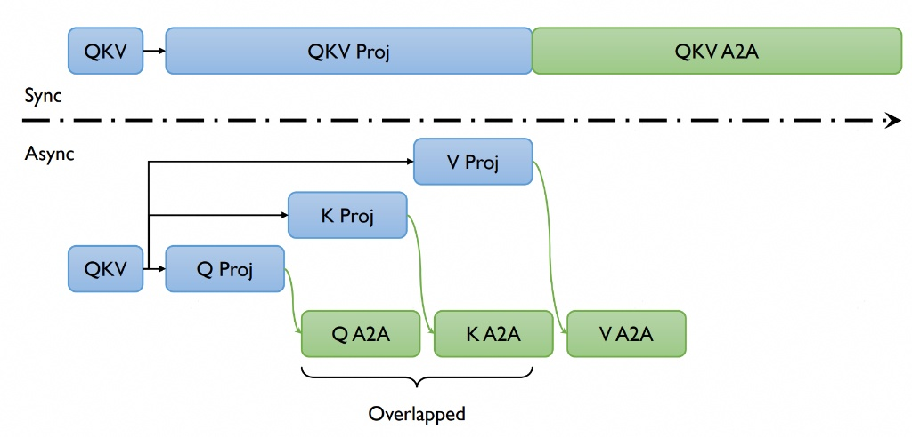

# Long-Sequence Training Using Ulysses

## Table of Contents

- [VeOmni Long-Sequence Training Using Ulysses](#veomni-long-sequence-training-using-ulysses)
  - [Table of Contents](#table-of-contents)
  - [📚 Overview](#-overview)
  - [🚀 Quick Start](#-quick-start)
  - [🔍 Dive into Ulysses Sequence Parallelism](#-dive-into-ulysses-sequence-parallelism)
    - [What is all\_to\_all?](#what-is-all_to_all)
    - [DeepSpeed-Ulysses](#deepspeed-ulysses)
    - [Communication Analysis](#communication-analysis)
  - [⚙️ Core API](#️-core-api)
  - [🛠️ Support Ulysses for a New Model](#️-support-ulysses-for-a-new-model)
  - [🧩 Implementation Details: Data Pipeline and Model Interaction](#-implementation-details-data-pipeline-and-model-interaction)
  - [🔧 Linear Attention Ulysses (GatedDeltaNet)](#-linear-attention-ulysses-gateddeltanet)

## 📚 Overview
In this tutorial, we introduce the implementation of DeepSpeed-Ulysses for efficient long-sequence training in VeOmni. The Ulysses method optimizes memory usage by splitting both the input tensor and intermediate activations along the sequence dimension. This innovative approach significantly enhances memory efficiency, enabling the training of models with longer sequence lengths.

Reference Paper: [DeepSpeed Ulysses: System Optimizations for Enabling Training of Extreme Long Sequence Transformer Models](https://arxiv.org/abs/2309.14509)

## 🚀 Quick Start
To enable Ulysses, users can specify the `accelerator.ulysses_size` parameter in the configuration file or the launch command:

```shell
bash train.sh tasks/train_vlm.py configs/multimodal/qwen25_vl/qwen25_vl.yaml \
    --model.model_path YOUR_MODEL_PATH \
    --data.train_path YOUR_DATA_PATH \
    --train.accelerator.ulysses_size 4
```

Currently, we have supported Ulysses on the following models:

Language models:
- LlaMa
- Qwen2.5
- Qwen3.5 (hybrid softmax + linear attention, requires transformers v5)

Multimodal models:
- Qwen2-VL
- Qwen2.5-VL

## 🔍 Dive into Ulysses Sequence Parallelism
Sequence Parallel (SP) serves as a prevalent strategy to handle long sequences that exceed the memory limit of a single GPU. Ulysses use all-to-all collective communication operations to implement SP with attention.

### What is all_to_all?

Suppose we have P GPUs and a sequence whose shape is [S, H], where N denotes the sequence length and d represents the hidden size (head num \* head dim). Each GPU initially holds the sequence's [S/P, H] partition. After performing an all_to_all communication, each GPU will get a head-splitting sequence whose shape is [S, H/P]. An illustration figure when P = 4 is as follows:



### DeepSpeed-Ulysses
We use the all_to_all based sequence parallelism which is proposed by DeepSpeed, named DeepSpeed-Ulysses.



(Image source: [DeepSpeed Ulysses: System Optimizations for Enabling Training of Extreme Long Sequence Transformer Models](https://arxiv.org/abs/2309.14509))

The figure above shows the overall architecture of DeepSpeed-Ulysses. It only introduces two extra all_to_all communications in the attention module while it does not modify other parts such as normalization and MLP. The input sequence is first evenly divided across the GPUs. The first all_to_all communication gathers the query, key, and value ([S/P, H]) along the sequence dimension and scatters the sequence in the head dimension ([S, H/P]). After the attention part, another all_to_all is performed to transfer the attention output ([S, H/P]) from head-sliced back to sequence-sliced ([S/P, H]). DeepSpeed-Ulysses is attention agnostic since it gathers the whole sequence dimension during attention computation. Thus, it can be easily used with FlashAttention. However, it is constrained by the number of attention heads since the sp size should be divided evenly by head_num. Note that DeepSpeed-Ulysses does not impact the memory consumed by the model states. To support large sequence-length training with a large language model, DeepSpeed-Ulysses can be integrated with ZeRO and FSDP.

### Communication Analysis
The communication volume transmitted per link for an all-to-all for aggregate message of size M over P GPUs can be estimated as $M(P-1)/P^2$. For a transformer model with hidden size H, the sequence length of S, and parallelism degree of P, and let $\mu = (P-1)/P$. DeepSpeed-Ulysses performs all-to-all for the QKV projections with an aggregate message size of $3SH$ before the attention computation, which introduces $3SH\mu/P$ communication volume; and another all-to-all for output context projection with a size Nh for each transformer layer, which introduces $SH\mu/P$ communication volume. Therefore, DeepSpeed sequence parallelism incurs an aggregate communication volume per link of $4SH\mu/P = 4M(P-1)/P^2$.

## ⚙️ Core API

1. gather_seq_scatter_heads

A method to do all-to-all before attention, make sure the sequence is full for attention score computation.

```Python
def gather_seq_scatter_heads(
    x: torch.Tensor,
    seq_dim: int,
    head_dim: int,
    unpadded_dim_size: int = 0,
    async_op: bool = False,
) -> Tensor
```

Args:
- x: tensor to be synced
- seq_dim: sequence dim that will be gathered
- head_dim: head dim that will be scattered. "head" is a concept from Multi-head Attention or Group Query Attention
- unpadded_dim_size: the full sequence size before padding and sharding
- async_op: if True, will return a torch._C._distributed_c10d.Work object, users can use this arg to do comm-compute overlap

2. gather_heads_scatter_seq

A method to do all-to-all after attention, transforming the activation from head-split to sequence-split.

```Python
def gather_heads_scatter_seq(
    x: torch.Tensor,
    head_dim: int,
    seq_dim: int
) -> Tensor
```

Args:
- x: Tensor to be synced
- head_dim: head dim that will be gathered
- seq_dim: sequence dim that will be scattered


3. reduce_sequence_parallel_loss

A method to reduce loss within the sequence parallel group, re-scale the loss according to the number of valid tokens.

```Python
def reduce_sequence_parallel_loss(
    loss: torch.Tensor,
    num_valid_tokens: torch.Tensor
) -> torch.Tensor
```

Args:
- loss: loss tensor to be reduced
- num_valid_tokens: the number of valid tokens in current rank

## 🛠️ Support Ulysses for a New Model

Typically, enabling Ulysses for a new model involves three key steps:

1. Create a sequence parallel group based on the specified Ulysses parallel size.
2. Shard input sequences across the sequence parallel groups.
3. Modify the model’s attention and loss computation to support Ulysses.

In VeOmni, the first two steps are automated. Users only need to specify the `accelerator.ulysses_size` parameter, and VeOmni will handle the creation of sequence parallel groups and the sharding of input data. This allows users to focus solely on step 3—modifying the model’s architecture to implement Ulysses sequence parallelism.

To make this process easier, we provide an abstract pseudo-code example as a reference for implementing Ulysses in a new model:

```Python
from veomni.distributed.sequence_parallel import (
    gather_seq_scatter_heads_qkv,
    gather_heads_scatter_seq,
    reduce_sequence_parallel_loss,
)
# Step1: Create a sequence parallel group
# VeOmni will construct a sequence parallel group based on the parallel size

# Step2: Shard input sequences
# Suppose we get an input x of shape [batch_size, seq_len, dim]
# we first shard x among sequence parallel groups
# now x is of shape [batch_size, seq_len/n, dim] on each sp rank

# Step3 (part1): modify attention computation
x = self.qkv(x) # [batch_size, seq_pad/n, dim]
x = gather_seq_scatter_heads(x, seq_dim=1, head_dim=2) # [batch_size, seq_len, dim/n]
...
output = F.scaled_dot_product_attention(q, k, v, ...).reshape(...)
...
output = gather_heads_scatter_seq(output, head_dim=2, seq_dim=1) # [batch_size, seq_pad/n, dim]

# Step3 (part2): reduce loss after model forward
loss = loss_fct(logits, labels)
loss = reduce_sequence_parallel_loss(loss, num_valid_tokens)
return loss
```

## 🧩 Implementation Details: Data Pipeline and Model Interaction

Understanding how sequence parallelism data flows through the VeOmni pipeline is critical for
adding SP support to new models and for debugging shape mismatches. This section documents the
full lifecycle of tensors from the data collator to the model forward pass.

### Data Collator: `SequenceParallelCollator`

When SP is enabled, `MainCollator` appends a `SequenceParallelCollator` to its pipeline
(see `veomni/data/data_collator.py`). This collator handles three operations in order:

1. **Label shifting** — shifts `labels` left by 1 token (for next-token prediction).
2. **SP padding and slicing** — for each key in the batch:
   - **Pad** the sequence to be evenly divisible by `sp_size` (using `sp_pad_value` from `DataCollateInfo`).
   - **Slice** the sequence for the current SP rank (`tensor.narrow(dim, rank * chunk, chunk)`).
3. **Flash attention kwargs** — computed from `position_ids` *before* slicing it.

The default `DataCollateInfo` for each key:

| Key | `sp_slice` | `sp_pad_value` | Notes |
|-----|-----------|----------------|-------|
| `input_ids` | True | 0 | Sliced to local length |
| `labels` | True | -100 | Sliced to local length |
| `attention_mask` | False | 1 | Padded but NOT sliced (always all-ones for FA) |
| `position_ids` | False | 0 | Sliced **after** FA kwargs are computed from it |

**Key ordering detail:** `position_ids` is intentionally excluded from the general slicing loop.
It is first used at full length to compute `cu_seq_lens_q/k` via `add_flash_attention_kwargs_from_position_ids`,
then sliced afterward. This ensures the FA kwargs describe the full packed sequence boundaries, which
is needed by the flash attention kernel after the Ulysses all-to-all gathers the full sequence.

After the collator, the model receives:

| Tensor | Sequence length | Description |
|--------|----------------|-------------|
| `input_ids` | `S / sp_size` | Local token IDs |
| `labels` | `S / sp_size` | Local shifted labels |
| `position_ids` | `S / sp_size` | Local positions (correct absolute values) |
| `attention_mask` | `S` | Full-length all-ones mask |
| `cu_seq_lens_q` | varies | Computed from full `position_ids` before slicing |

### Softmax Attention (Flash Attention) SP Flow

For standard softmax attention layers (e.g., `Qwen3_5Attention`), Ulysses SP is handled
**internally** by `flash_attention_forward` in `veomni/ops/flash_attn/__init__.py`.

The flow through a softmax attention layer:

```
hidden_states [B, S_local, D]           # already local from collator
  -> QKV projection                      # [B, S_local, num_heads, head_dim]
  -> apply_rotary_pos_emb(q, k, cos, sin)  # RoPE on local-length q/k
  -> flash_attention_forward:
       gather_seq_scatter_heads(q,k,v)   # [B, S_full, local_heads, head_dim]
       flash_attention_kernel(...)       # attention on full sequence, local heads
       gather_heads_scatter_seq(output)  # [B, S_local, num_heads, head_dim]
  -> output projection                   # [B, S_local, D]
```

**Important:** Position embeddings (`cos`, `sin`) must match `hidden_states` length (`S_local`).
Since `position_ids` is already sliced by the collator, `rotary_emb(hidden_states, position_ids)`
produces local-length position embeddings — no additional slicing is needed.

> **Note on Qwen3/Qwen3-MoE:** These models use LigerKernel's `apply_rotary_pos_emb` which tolerates
> mismatched sequence lengths between q/k and cos/sin. Qwen3.5 uses the standard HuggingFace
> implementation, which requires exact size match. When adding SP to a new model, always check
> which RoPE implementation is active.

### Loss Reduction

When SP is enabled, each rank computes loss on its local sequence shard. The loss must be
reduced across the SP group, re-scaled by the number of valid (non-padding) tokens per rank.
This is handled by `reduce_sequence_parallel_loss` or by the fused loss in the model's forward
method. See the Core API section above for details.

---

## 🔧 Linear Attention Ulysses (GatedDeltaNet)

Hybrid models like Qwen3.5 alternate between softmax attention layers and linear attention
layers (GatedDeltaNet). While softmax attention SP is handled transparently by
`flash_attention_forward`, linear attention layers require **explicit Ulysses SP logic** in
their forward method because they use a different attention mechanism (recurrence-based, not
score-based) with additional components like causal conv1d.

### Why Linear Attention Needs Special Handling

1. **No shared flash attention path** — GatedDeltaNet uses `chunk_gated_delta_rule` from FLA, not flash attention.
2. **Causal conv1d** — operates along the sequence dimension. Each rank only has a local sequence shard, so the conv1d must run on the full sequence with appropriately sharded weights.
3. **Per-head parameters** — `A_log` and `dt_bias` are indexed by head, so they need slicing for local heads.

### GatedDeltaNet Ulysses SP Flow

```
hidden_states [B, S_local, D]
  -> QKV + z + b + a projections

  IF ulysses_enabled:
    -> split mixed_qkv into Q, K, V and reshape to [B, S_local, num_heads, head_dim]
    -> gather_seq_scatter_heads(Q, K, V, b, a)   # [B, S_full, local_heads, ...]
    -> flatten heads + concat Q,K,V               # [B, S_full, local_conv_dim]
    -> _get_local_conv1d_weight(rank)             # shard conv1d weights for local heads
    -> causal_conv1d(mixed_qkv, local_weight, cu_seqlens=cu_seq_lens_q)
    -> split and reshape with local head counts
    -> slice A_log, dt_bias for local V-heads
    -> chunk_gated_delta_rule(q, k, v, g, beta, cu_seqlens=cu_seq_lens_q)
    -> gather_heads_scatter_seq(attn_out)         # [B, S_local, num_v_heads, head_v_dim]
    -> gated_norm(attn_out, z)                    # z was NOT all-to-all'd
    -> output projection
  ELSE:
    -> standard (non-SP) forward path
```

### Conv1d Weight Sharding

The conv1d weight has shape `[Q_channels | K_channels | V_channels, kernel_size]`.
Under Ulysses SP, each rank only processes local heads, so the conv1d weight must be
sharded to extract only the channels corresponding to local Q, K, V heads:

```python
def _get_local_conv1d_weight(self, ulysses_rank, local_key_dim, local_value_dim):
    w_full = self.conv1d.weight.squeeze(1)  # [conv_dim, kernel_size]
    k_off = ulysses_rank * local_key_dim
    v_off = ulysses_rank * local_value_dim
    w_q = w_full[k_off : k_off + local_key_dim]
    w_k = w_full[key_dim + k_off : key_dim + k_off + local_key_dim]
    w_v = w_full[2 * key_dim + v_off : 2 * key_dim + v_off + local_value_dim]
    return torch.cat([w_q, w_k, w_v], dim=0)
```

### Key Difference: `z` Is NOT All-to-All'd

The gating signal `z` is used *after* the attention output is gathered back to local
sequence layout (`gather_heads_scatter_seq`). Since `z` starts at `[B, S_local, num_v_heads, head_v_dim]`
and the gathered attention output is also `[B, S_local, num_v_heads, head_v_dim]`, they
match without any all-to-all on `z`. This saves one all-to-all communication.

### `cu_seq_lens_q` Usage

`cu_seq_lens_q` describes the packed sequence boundaries (computed from full `position_ids` before
slicing). After the all-to-all gathers the full sequence, `cu_seq_lens_q` correctly describes the
sequence boundaries for the causal conv1d and chunk attention kernels.

### Head Divisibility Requirement

Both `num_k_heads` and `num_v_heads` must be divisible by `ulysses_size`. For GQA (grouped query
attention) where `num_v_heads > num_k_heads`, the GQA repeat ratio `num_v_heads // num_k_heads`
is preserved after dividing both by `ulysses_size`.

### Testing

Tests for GatedDeltaNet Ulysses SP are in `tests/parallel/ulysses/test_qwen3_5_gated_deltanet_ulysses.py`:

1. **Conv1d weight slicing** — single-GPU, validates that sliced conv1d output matches the
   corresponding slice of full conv1d output.
2. **SP forward/backward equivalence** — multi-GPU, compares SP partitioned outputs and gradients
   against a non-SP baseline.
3. **SP forward determinism** — multi-GPU, verifies repeated forward passes produce identical outputs.
4. **Non-SP forward determinism** — single-GPU, baseline determinism check.

---

## ⚡ Async Ulysses CP

We also support **Async Ulysses** which further improves performance by overlapping communication and computation, reducing communication latency and improving hardware utilization.

### Asynchronous Ulysses



VeOmni extends the original Ulysses implementation with asynchronous communication capabilities, further improving performance by overlapping communication and computation.

#### Performance Benefits

By overlapping communication and computation, Async Ulysses:
- Reduces idle time during communication operations
- Lowers end-to-end training time
- Maintains nearly the same memory efficiency as original Ulysses

#### Enabling Async Ulysses

To enable Async Ulysses, simply set the `accelerator.enable_async` parameter to `True`:

Notice: Async Ulysses works when `accelerator.ulysses_size > 1`.

```shell
bash train.sh tasks/train_vlm.py configs/multimodal/qwen3_vl/qwen3_vl_dense.yaml \
    --train.accelerator.ulysses_size 4 \
    --train.accelerator.enable_async true
```


### API

1. async_ulysses_qkv_projection

An asynchronous method to perform QKV projection and all-to-all communication, overlapping computation and communication.

```Python
def async_ulysses_qkv_projection(
    hidden_states: torch.Tensor,
    seq_dimension: int,
    head_dimension: int,
    q_weight: torch.Tensor,
    q_bias: Optional[torch.Tensor],
    k_weight: torch.Tensor,
    k_bias: Optional[torch.Tensor],
    v_weight: torch.Tensor,
    v_bias: Optional[torch.Tensor],
    norm_type: Optional[str] = None,
    norm_q_weight: Optional[torch.Tensor] = None,
    norm_q_bias: Optional[torch.Tensor] = None,
    norm_k_weight: Optional[torch.Tensor] = None,
    norm_k_bias: Optional[torch.Tensor] = None,
    normalized_shape: Optional[Union[int, torch.Size]] = None,
    eps: float = 1e-5,
    unpadded_dim_size: int = 0,
    head_dim: int = 0,
    group: Optional[ProcessGroup] = None,
) -> Tuple[torch.Tensor, torch.Tensor, torch.Tensor]
```

Args:
- hidden_states: Input hidden states
- seq_dimension: Sequence dimension
- head_dimension: Head dimension
- q_weight: Query projection weight
- q_bias: Query projection bias
- k_weight: Key projection weight
- k_bias: Key projection bias
- v_weight: Value projection weight
- v_bias: Value projection bias
- norm_type: Normalization type ("rmsnorm" or "layernorm")
- norm_q_weight: Query normalization weight
- norm_q_bias: Query normalization bias
- norm_k_weight: Key normalization weight
- norm_k_bias: Key normalization bias
- normalized_shape: Normalization shape
- eps: Normalization epsilon
- unpadded_dim_size: Unpadded dimension size
- head_dim: Head dimension size
- group: Process group (optional)

2. async_ulysses_output_projection

An asynchronous method to perform output projection and all-to-all communication.

```Python
def async_ulysses_output_projection(
    hidden_states: torch.Tensor,
    seq_dimension: int,
    head_dimension: int,
    proj_weight: torch.Tensor,
    proj_bias: Optional[torch.Tensor],
    unpadded_dim_size: int = 0,
    group: Optional[ProcessGroup] = None,
) -> torch.Tensor
```

Args:
- hidden_states: Input hidden states
- seq_dimension: Sequence dimension
- head_dimension: Head dimension
- proj_weight: Projection weight
- proj_bias: Projection bias
- unpadded_dim_size: Unpadded dimension size
- group: Process group (optional)


### Enabling Async Ulysses

To enable Async Ulysses for an existing model, you need to:

1. Check if Async Ulysses is supported for your model (currently supported for Qwen3VL Dense)
2. Set `accelerator.enable_async=True` in your training configuration
3. Ensure you're using Flash Attention 2.0 and Ulysses Context Parallelism is **enabled**
4. Verify that your hardware supports asynchronous operations

Async Ulysses is currently available for the following models:
- Qwen3VL Dense

Support for more models will be added in future releases.
