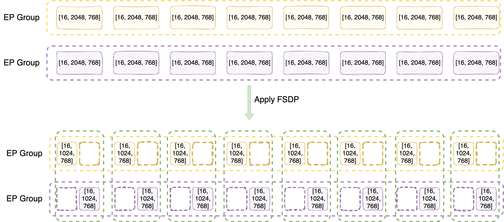

# VeOmni's EP+FSDP2 for Large-scale MoE Model Training

**Author**: Tianle Zhong

> TL;DR: VeOmni now supports EP+FSDP2 from v0.1.0; Simply try it out by setting `data_parallel_mode` to `fsdp2` and `expert_parallel_size` to larger than 1.


## Motivation

EP+FSDP1 is supported in VeOmni in the first day.
However, with the [deprecation of FSDP1](https://docs.pytorch.org/tutorials/intermediate/FSDP1_tutorial.html), FSDP2 becomes a necessary upgrade, which also introduces several benefits besides maintainability:

* Flexibility of per-parameter sharding (along any dimension of the tensor)
* Easier to configure prefetching to overlap communication and computation
* Simpler to manipulate hooks (no complicated `FSDPExtension`)
* Avoid use of annoying `FlattenParamter` in FSDP1 which has many side-effects.

For more info, please look up the official [FSDP2 tutorial](https://docs.pytorch.org/tutorials/intermediate/FSDP_tutorial.html).

## Design Overview

In this section, we introduce the overall design of EP+FSDP2 in VeOmni so that you can understand the logical flow for correct setting up the expert parallel size in your training config.

### Sharding Dimension

In VeOmni, experts module is defined as tensors of [E, H, I] (Expert number, hidden dim, intermediate size) for down projection weights, and [E, I, H] for gate projection and up projection.

> please see [example of how we merge the Qwen3-MoE expert weight](../examples/qwen3_moe.md)

The expert parallelism (EP) is applied on dim-0 (expert number), while FSDP2 is applied on dim-1 instead of default dim-0.

This is to enable more flexible parallelism setup. Otherwise, if we also choose dim-0 for FSDP2, EP size x FSDP2 size needs to be exact expert number.

### Parallelism Setup



Let's take Qwen3-MoE-30B-A3B model for example, which has 128 experts, hidden dim size of 2048, and intermediate size of 768. So, we can view expert weights as

* Gate projection: [128, 768, 768]
* Up projection: [128, 768, 2048]
* Down projection: [128, 2048, 768]

Next, let's understand how they are sharded by EP and FSDP2 in logical view.

First consider a case of 2 x 8-GPU instances (16 GPUs in total), and we set FSDP2 size to 16 (always same as #GPU), EP size to 8. For clearity, we focus on down projection layer

* Inside one instance, sharded by EP first -> [128/8=16, 2048, 768], assigned device mesh of [0, 1, 2, 3, 4, 5, 6, 7] for EP.
    * Same on the other instance, which is assign with EP device mesh of [8, 9, 10, 11, 12, 13, 14, 15].
* Since for rank 0 and 8, they hold the same partition of experts (first 16 experts), they become a FSDP2 group (FSDP degree of 2), sharded along dim-1 -> [16, 2048/2=1024, 768], assigned with FSDP2 device mesh of [0, 8].
    * Same for other rank pairs that hold the same partition of experts.

In summary,

* For expert module, EP size x FSDP2 size = world size
    * Logically they have 2-dim device mesh of [EP, EP_FSDP].
* For non-expert module, since EP does not affect them, they only have FSDP2, where FSDP2 size = world size.
    * Only 1-dim device mesh of [FSDP, ]

At this step, you already understand how EP+FSDP2 is designed in VeOmni which is sufficient to setup the training! If you are not interested in the implementation details, you can skip the following sections.

The methods discussed in the following sections are trasparent to the end users and automically applied by VeOmni, without any additional efforts to configure.

## Expert Parallelism Details

> File: veomni/distributed/parallel_plan.py

As a model-centric framework, VeOmni registers leaf expert weight keys, i.e, "fully qualified name" (fqn) in the model's definition as an attribute. (see `veomni/models/transformers/qwen3_moe/parallel_plan.py` for example.)

In this way, each model exposes `get_parallel_plan()` method which returns a `ParallelPlan` containing an `ep_plan` dict. Keys are parameter FQN patterns that identify expert weights; values are `Shard(dim=...)` telling which tensor dimension is sharded across EP ranks (in this case always dim-0 to shard expert number).

After applying EP sharding on these registered modules, we immediately drop their device mesh info by replacing the parameter with its local shard. This is because we do not want to gather them back during experts computation like FSDP, we would mauanlly control how EP ranks interact with each other in the model's fused MoE implementation.

> In this way, we also avoid using experimental APIs like TorchTitan to override TP-oriented `parallelize_module` to implement EP.

## FSDP2 Details

> File: veomni/distributed/torch_parallelize.py

### Sharding from the bottom up

FSDP2 relis on `fully_shard`, which should be applied in a bottom-up fashion.

For EP+FSDP2, a simplified view looks like:

```python
for layers in model:
    if layers.mlp.experts:
        fully_shard(layers.mlp.experts) # along dim-1 by placement_fn
    fully_shard(layer)
fully_shard(model)
```

### Sharding Modules with Correct Dimensions

Since we have different sharding strategy for experts and non-experts module, we need to distinguish them so that we can apply FSDP2 on them correctly.

In VeOmni, the decoder layers are passed as `basic_modules` to the model parallelization method, so that we can find the layers in the model.

Then, we need to find the experts inside the layers if they exist. We cannot rely on a predefined naming pattern like `layer.mlp.experts` since different model may have different naming patterns. Similar to EP, we derive the expert module from the EP plan keys that are registered in the model definition.

### Configuring Proper Prefetching

Due to the nested sharding of EP+FSDP2, the default prefetching configuration of FSDP2 is no longer efficient, and we need to set the prefetching manually.

In short words, each decoder layer need to prefetch the next/prev decoder layer's attention and expert module explicitly during forward/backward.

Otherwise, the attention and expert modules are treated as separate layers. In this case, the time of attention computation often cannot fully overlap the AllGather for expert module.

### Consequences of Mixed Sharding Strategy

Due to today's PyTorch DTensor limitation, we need to separate optimizers for experts and non-experts module, same for LR schedulers and grad norm clipping method.

* `MultiOptimizer` class: `veomni/optim/optimizer.py`
* `MultiLRScheduler` class: `veomni/optim/lr_scheduler.py`
* EP-aware grad norm clipping: `veomni/distributed/fsdp2/clip_grad_norm.py`

These consequences like the parallelization method, are transparent to the end users and do not need additional efforts to configure.

## PyTorch Distributed Checkpoint (DCP) Support

> File: veomni/checkpoint/checkpointer.py

Since EP-dim is dropped for expert modules, the DCP has no way to be aware about the EP rank infomations.

To address this issue, we temporarily restore EP-dim when saving model state dicts to DCP checkpoints. This ensures we can restore model state dicts correctly when load them back.

After loading process, we drop EP-dim again to avoid confusing the FSDP process of expert module again.

Note that this is implemented in `ModelState` class, which is used for saving checkpoints only. So, the other calls of `model.state_dict()` is not affected.

## Acknoledgements

We largely refer the implementations in [TorchTitan](https://github.com/pytorch/torchtitan) to address the consequences of mixed sharding.

Big thanks to ByteDance Seed and AML team: Qianli Ma, Bin Jia, Yifan Pi, Xiao Yu
